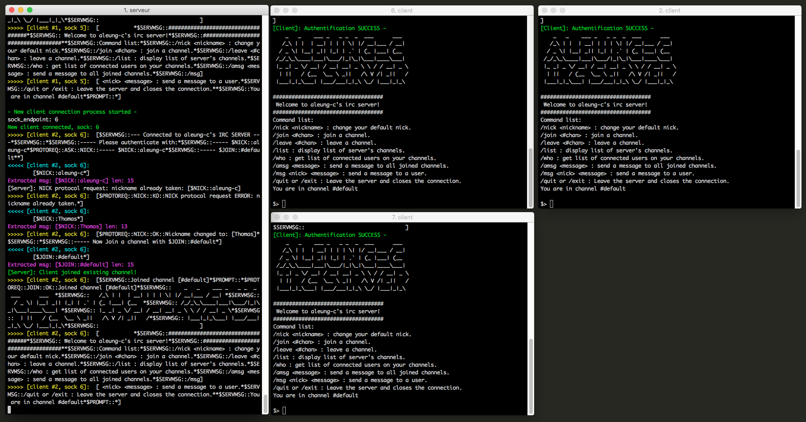
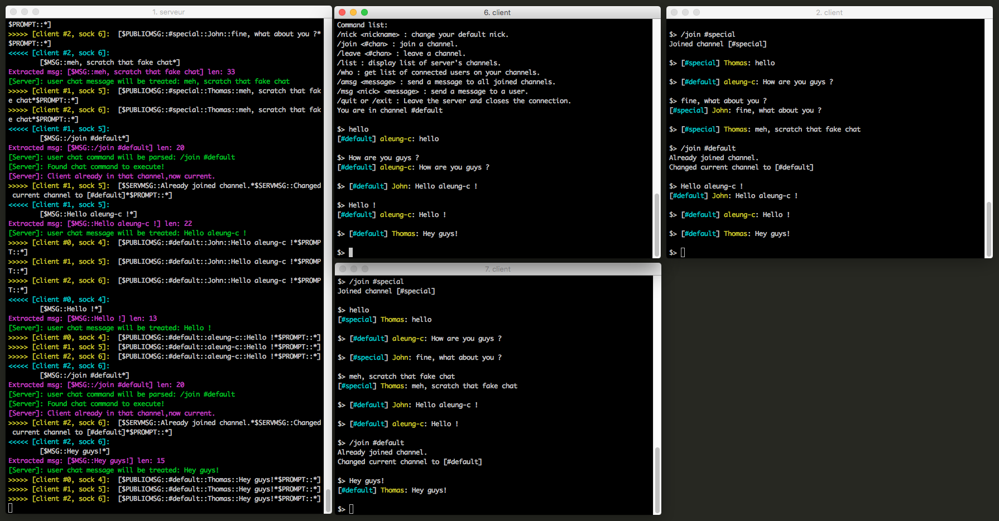
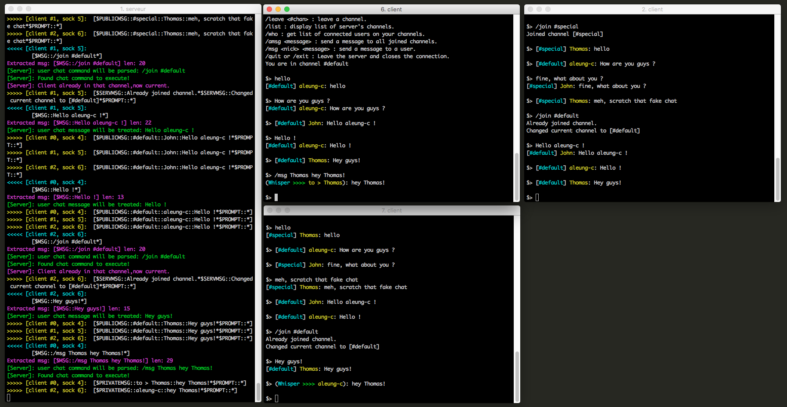

# IRC_server-client

This C project is a classic of programming schools: the IRC server and client communication program.

The idea was to make a sort of IRC-like server, that can run continuously and accept connections from other programs.
Then we have a client program, that can connect to the server and send and receive messages.

The server is the core of the project. It is where the logic is processed, as the clients are only meant
to display receptions and handle the user's input toward the server.
But it is the server who receives and redirects messages toward the users.

Several functionalities have been implemented, such as channels and private messages between users, and some
basic irc commands.
The server uses select() to handle the reception and the sending of messages on a single-thread.

On the back-end of the program, there is a subtle protocol that have been implemented, to create a shallow safety system,
meaning 'not any program can connect and mess with the server'. Any program not respecting the protocol format
and its message size is disconnected from the server.

The protocol vaguely resembles the IRC rfc protocol, but is not in any case an rfc implementation. For example, a message from
the server has this form:

```
$SERVMSG::--- Connected to aleung-c's IRC SERVER ---
```

And here is a request for a nickname:

```
$PROTOREQ::ASK::NICK::----- $NICK::aleung-c
```

This makes a simple multi-client friendly chat program. Here are some output examples.
On the right, you can see the server's running output, and the three windows on the right are clients communicating:


Connecting to the server:



Simple communication on channels:



Private message example:


